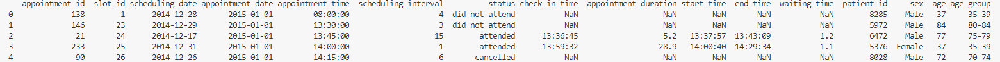
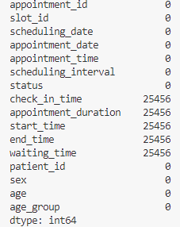
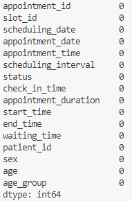

# Data Mining and Descision Tree Algorithms
### Working with Patient appointment request dataset:

https://www.kaggle.com/datasets/carogonzalezgaltier/medical-appointment-scheduling-system

---
### Problem to be solved:

"Will a patient show up to their medical appointment?"

---
### Further Analysis - Regression or classification
For the aforementioned problem, I've gone with classification as we're predicting a binary outcome. Whether or not the patient will show up to their appointment - yes/no, true/false, 1/0.

Regression would be used if we were predicting a continuous value, like the number of days a patient has to wait in order to get an appointment or be seen by the doctor.

---
### EDA + Preprocessing
1. __Load the dataset__

    

2. __Check for missing values__

    for the logs where status is either "unattended" or "cancelled" the values for "check_in_time", "appointment_duration", "start_time", "end_time" and "waiting_time" are missing since obviously the appointment wasn't attended to begin with. however when checked specifically for attended appointment, there are no null values outside of the columns mentioned above.
 
    <ins>checking all columns for null values:</ins>

    
     
    <ins>checking for null values in the "attended" status:</ins>

    

3. __Convert categorical data where needed (it was needed)__
    
    For this, status and sex will be converted to numerical values in order to be used for analysis and model building. Male = 0, Female = 1. Since status has more than 2 values, i'll be hot encoding it. creating new columns for each value and assigning 1 or 0 based on the value in the original column.

4. __Removing noisy/irrelevant data__

    TBD yet - will be done after further analysis
5. __Data Visualisation__

    This is to get a better understanding of the data and see if there are any patters or trends to be observed. This will be done using: 

    a. Histograms

    b. Boxplots - for outliers

    c. Correlation matrix